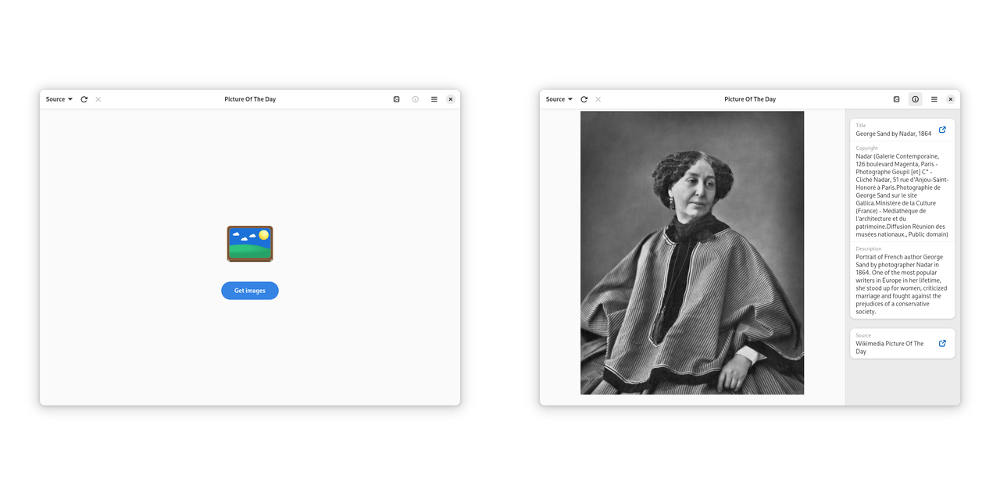

# Picture Of The Day

[](https://github.com/swsnr/picture-of-the-day/releases)
[](https://translate.codeberg.org/engage/de-swsnr-pictureoftheday/)
[](https://github.com/swsnr/picture-of-the-day/actions)

A daily picture as your wallpaper in GNOME:



Get a picture of the day from any of the following sources as your daily wallpaper.

- [NASA Astronomy Picture Of The Day](https://apod.nasa.gov/)
- [Bing](https://bing.com)
- [Simon Stålenhag Artwork](https://simonstalenhag.se/)
- [Wikimedia Picture Of The Day](https://commons.wikimedia.org/wiki/Main_Page)

Note that all images are protected by copyright; you may not be allowed to use or distribute them. Do take a look at the license terms for each image.

## Installation

Under construction

## Translations

Please submit translations to <https://translate.codeberg.org/engage/de-swsnr-pictureoftheday/>.

## Troubleshooting

You can obtain a debugging log by running Picture Of The Day as follows from a terminal:

```console
$ flatpak run --env=G_MESSAGES_DEBUG=all de.swsnr.pictureoftheday
```

## License

This Program is subject to the terms of the Mozilla Public License, v. 2.0. If a copy of the MPL was not distributed with this file, You can obtain one at <http://mozilla.org/MPL/2.0/>.
