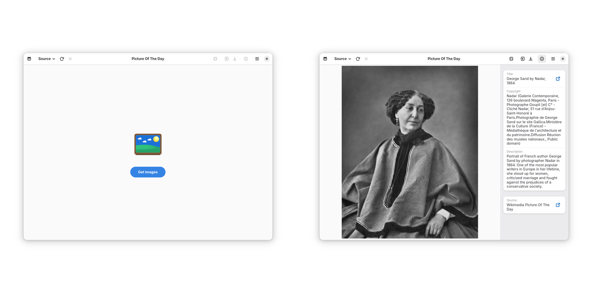

# Picture of the Day

[](https://translate.codeberg.org/engage/de-swsnr-pictureoftheday/)

Your daily GNOME wallpaper:



Get a picture of the day from any of the following sources as your daily wallpaper.

- [NASA Astronomy Picture of the Day](https://apod.nasa.gov/)
- [Bing](https://bing.com)
- [Simon Stålenhag Artwork](https://simonstalenhag.se/)
- [Wikimedia Picture of the Day](https://commons.wikimedia.org/wiki/Main_Page)
- [Earth Science Picture of the Day](https://epod.usra.edu/blog/)
- [NASA Earth Observatory Image of the Day](https://earthobservatory.nasa.gov)

Note that all images are protected by copyright; you may not be allowed to use or distribute them. Do take a look at the license terms for each image.

## Installation

- [Flathub](https://flathub.org/apps/details/de.swsnr.pictureoftheday)

## Translations

Please submit translations to <https://translate.codeberg.org/engage/de-swsnr-pictureoftheday/>.

## Troubleshooting

You can obtain a debugging log by running Picture of the Day as follows from a terminal:

```console
$ flatpak run --env=G_MESSAGES_DEBUG=all de.swsnr.pictureoftheday
```

## License

Copyright Sebastian Wiesner <sebastian@swsnr.de>

Licensed under the EUPL, see <https://interoperable-europe.ec.europa.eu/collection/eupl/eupl-text-eupl-12>
